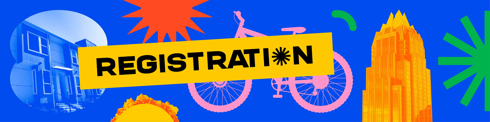

We look forward to welcoming you, and together, we can make a meaningful impact in the world of housing and urbanism. We have established three levels of registration.

# [Register now](https://yimby.town/#registration=1)

**Full Registration - $395**\
Full registration fees contribute to covering a wide range of essential costs that go into making YIMBYtown 2024 a success, including the space for bringing so many people together, food and logistics, as well as speaker costs. We appreciate your support.

**Advocate Registration - $195**\
We welcome nonprofit staff, volunteer advocates, academics, students, and others to register for YIMBYtown at the Advocate rate. This half-priced rate aims to make it accessible for individuals and organizations working with limited budgets who are eager to contribute to the vibrant discussions, workshops, and networking opportunities at YIMBYtown.

**Needs Based Complimentary Registration**\
We welcome those who care about building abundant housing and want to attend YIMBYtown – but for whom registration cost would be a barrier – to self-select for complimentary registration. This ensures that YIMBYtown remains an inclusive and welcoming platform where voices from all walks of life can come together to explore solutions and drive positive change in the housing landscape. We are immensely grateful to our sponsors for making this commitment to inclusivity possible.

**Equitable Access Program: Travel and Lodging Subsidies**

At the heart of the YIMBYtown Conference is our unwavering commitment to making participation accessible and inclusive. To that end, we are continuing the YIMBYtown tradition of providing funding to selected eligible attendees, with the goal of making YIMBYtown 2024 as diverse and accessible as the YIMBY communities we work towards. \
\
The program is available to anyone who will commit to attending all three days of YIMBYtown, and will be dedicated on a first-come first serve basis.

**[Apply for the YIMBYtown 2024 Equitable Access Program](https://forms.gle/b459SRZ4b35Q7xx26)**

# [Register now](https://yimby.town/#registration=1)

**Media**\
We expect to make complimentary registrations available to media. If you would like to cover YIMBYtown 2024, please contact us at liz@yimby.town.