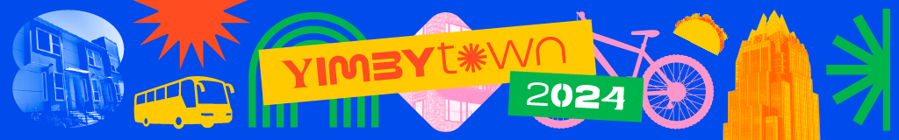
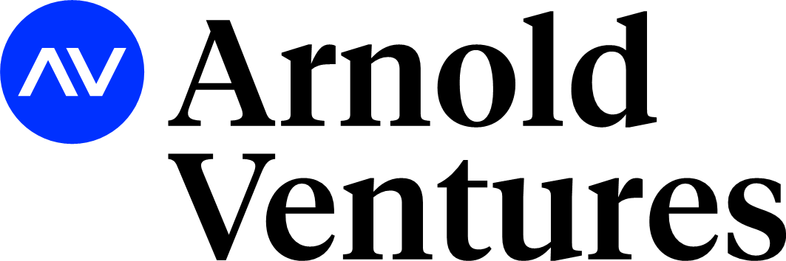
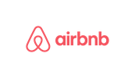
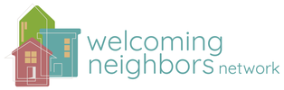
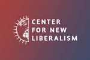
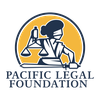
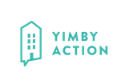
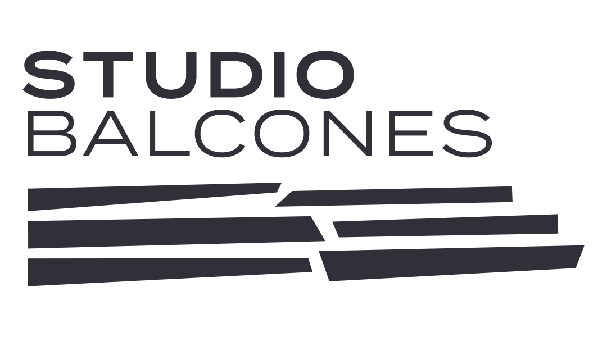

Thank you to all our generous sponsors!

# <em>**GREENBELT - $25,000**</em>

# **TACO TRUCK - $10,000**

# **BIKE PATH - $5,000**

# **PLAYGROUND - $1,000**

# **Block Party - $500**

# **Become A Sponsor!**

We invite firms, corporations, and public entities to join us as sponsors. Your generous contribution will help us cover costs for venue rentals, transportation, guest speakers, workshops, and outreach efforts, and 501c3 projects of AURA and Farm&City to further support for the goals articulated at YIMBYtown. By supporting YIMBYtown 2024, you are investing in the future of housing equity, community empowerment, and social change. All sponsors will receive complimentary passes, recognition, and other brand visibility opportunities commensurate with level of sponsorship.

**BLOCK PARTY - $500**

Your logo will be displayed on select conference materials and electronic communications, and you will receive one complimentary registration. 

**PLAYGROUND - $1,000**

Block Party + an additional complimentary registration. 

**BIKE PATH - $5,000**

Playground + a booth at the conference and an additional two registrations (total of 4) 

**TACO TRUCK - $10,000**

Six complimentary registrations, premier brand visibility on conference materials, booth space, and the opportunity to introduce a speaker 

**GREENBELT - $25,000**

Eight complimentary registrations, premier brand visibility on conference materials, booth space, and the opportunity to introduce a speaker. 

> Sponsor now: <https://secure.everyaction.com/OmfNEt5iQkGx3A1g-UhJGw2> 

or make checks out to “Farm&City” and mail to:

Farm&City\
PO Box 171\
Austin, TX 78767 

To arrange for other forms of payment, please call (713) 244-4746 or email [katrina@farmandcity.org](mailto:katrina@farmandcity.org)

YIMBYtown 2024 is a project of Farm&City, a 501(c)3 nonprofit.